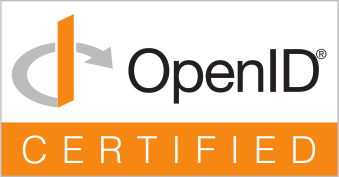

# Openid Foundation Certification

<br clear="left"/>

<picture style="margin-right: 15px; float: left;">
  <source
    media="(prefers-color-scheme: dark)"
    srcset="assets/certified-dark.svg"
    width="170px"
    align="left"
  />
  <source
    media="(prefers-color-scheme: light)"
    srcset="assets/certified-light.svg"
    width="170px"
    align="left"
  />
  
</picture>

This repository contains support materials for conformance testing
and certification.

[](https://github.com/erlef/security-wg)
[](https://github.com/erlef/oidcc/blob/main/LICENSE)

<br clear="left"/>

<picture style="margin-right: 15px; float: left;">
  <source
    media="(prefers-color-scheme: dark)"
    srcset="assets/erlef-logo-dark.svg"
    width="170px"
    align="left"
  />
  <source
    media="(prefers-color-scheme: light)"
    srcset="assets/erlef-logo-light.svg"
    width="170px"
    align="left"
  />
  
</picture>

The certification is funded as an
[Erlang Ecosystem Foundation](https://erlef.org/) stipend entered by the
[Security Working Group](https://erlef.org/wg/security).

<br clear="left"/>

## Files

* `/submitted_certifications/Erlang_Ecosystem_Foundation-oidcc-[PROFILE]-[DATE].zip` - Finalized Certification

## Conformance Testing

### Setup

- Register on https://www.certification.openid.net/
- Create Testplan https://www.certification.openid.net/schedule-test.html

### Conformance Profiles to Test

#### OpenID Connect Core: Basic Certification Profile Relying Party Tests

- **Relevant for Certification: Yes**
- Id: `oidcc-client-basic-certification-test-plan`
- Request Type: `plain_http_request`
- Client Registration Type: `dynamic_client`

#### OpenID Connect Core Client Tests: Comprehensive client test

- **Relevant for Certification: No**
- Expected Failures
  - `oidcc-client-test-discovery-webfinger-acct` - WebFinger is not supported
  - `oidcc-client-test-discovery-webfinger-url` - Webfinger is not supported
- Id: `oidcc-client-test-plan`
- Client Authentication Type: `client_secret_post`
- Request Type: `plain_http_request`
- Response Type: `code`
- Client Registration Type: `dynamic_client`
- Response Mode: `default`

#### OpenID Connect Core Client Refresh Token Profile Tests: Relying party refresh token tests

- **Relevant for Certification: No**
- Id: `oidcc-client-refreshtoken-test-plan`
- Client Authentication Type: `client_secret_basic`
- Request Type: `plain_http_request`
- Response Type: `code`
- Client Registration Type: `dynamic_client`
- Response Mode: `form_post`

#### OpenID Connect Core: Form Post Basic Certification Profile Relying Party Tests

- **Relevant for Certification: Yes**
- Id: `oidcc-client-formpost-basic-certification-test-plan`
- Request Type: `plain_http_request`
- Client Registration Type: `dynamic_client`

#### OpenID Connect Core: Configuration Certification Profile Relying Party Tests

- **Relevant for Certification: Yes**
- Id: `oidcc-client-config-certification-test-plan`
- Client Authentication Type: `client_secret_basic`
- Request Type: `plain_http_request`
- Response Mode: `default`
- Client Registration Type: `dynamic_client`

#### OpenID Connect Core Client Login Tests: Relying party 3rd party initiated login tests

- **Relevant for Certification: Yes**
- Id: `oidcc-client-test-3rd-party-init-login-test-plan`
- Client Authentication Type: `client_secret_basic`
- Request Type: `plain_http_request`
- Response Mode: `default`
- Client Registration Type: `dynamic_client`

#### FAPI2-Security-Profile-ID2: Relying Party (client) test

- **Relevant for Certification: Yes**
- Id: `fapi2-security-profile-id2-client-test-plan`
- Client Authentication Type: `private_key_jwt`
- Sender COnstraining: `dpop`
- FAPI Client Type: `oidc`
- FAPI Profile: `plain_fapi`
- Server
  - jwks: `./artifacts/server.priv.jwkset`
- Client
  - client_id: `client_id`
  - scope: `openid profile`
  - redirect_uri: `http://localhost:4000/callback`
  - jwks: `./artifacts/client.pub.jwkset`

## How to Execute the tests

### Setup

```console
mix deps.get
```

Optionally, you can mount the certification branch in your worktree:

```console
git worktree add \
  --track \
  -b openid-foundation-certification \
  certification \
  origin/openid-foundation-certification
```

### Run

- Open Plan / Specific Test
- Execute the Conformance runner:
  ```console
  mix run_certification \
    --profile [PROFILE_NAME] \
    --test-name [TEST_NAME] \
    --alias [ALIAS] \ # Alias in www.certification.openid.net; Default "test"
    --version [VERSION] \ # Version to file Result artifacts for; Default "dev"
    --[no-]register-client \ # Run Client Registration; Default true; Disable for config only tests
    --[no-]start-server \ # Run Web Server; Default true; Disable for config / client only tests
    --[no-]auto-stop \ # Auto Stop when result is received; Default true; Disable for tests with multiple actions
    --[no-]auto-open \ # Auto open browser; Default false; Requires `xdg-open`
    --[no-]auto-screenshot \ # Auto screenshot window; Default false; Requires `gnome-screenshot` & `optipng`
    --token-endpoint-auth-method \ # Registration token_endpoint_auth_method; Default "client_secret_basic"
  ```
- Open http://localhost:4000/authorize in your Browser (or `auto-open`)
- Follow Test Protocol
- Test should pass
- Upload Screenshot to Test Protocol

### Package Certification

After all tests have completed, prepare the publication.

- Create `Certification of Conformance.pdf` in `test_plans/[VERSION]/[PROFILE]`
- Package Client Data
  ```console
  mix package_client_data \
    --version [VERSION] \
    --profile [PROFILE]
  ```
- Upload signed
  [Certification of Conformance](https://openid.net/wordpress-content/uploads/2021/07/OpenID-Certification-of-Conformance.pdf) and
  `test_plans/[VERSION]/[PROFILE]/client-data.zip` via
  `Publish for certification` in certification.openid.net / Plan
- File downloaded `.zip` as
  `/submitted_certifications/Erlang_Ecosystem_Foundation-oidcc-[PROFILE]-[DATE].zip`
- Commit & Push File into PR
- Once merged, fill out the
  [certification request form](https://openid.atlassian.net/servicedesk/customer/portal/3/group/3/create/10016).
